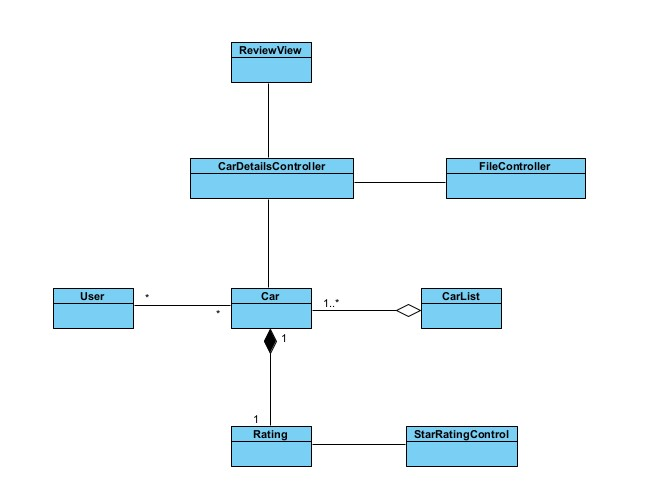

# Drive Sync - Car Rating App

[Project Link](https://github.com/nayanmapara/DriveSync)

## Project Overview

The **Drive Sync** project aims to create a Car Rating App enabling users to review and rate cars from 2023 and beyond. The application offers users the ability to browse and access detailed information about various car models, including ratings, prices, and specifications. The project is implemented using Java 17 and the JavaFX framework for the graphical user interface. The development environment of choice is Visual Studio Code and version control and collaboration are facilitated through GitHub.

## Project Team

- Het Patel
- Nayan Mapara

## Project Objectives

1. Develop a user-friendly interface for browsing and accessing car information.
2. Allow users to rate and review cars.
3. Store car and user information using file I/O operations.
4. Utilize dynamic data structures (ArrayList) to manage car objects.
5. Create a visually appealing and responsive design using JavaFX.
6. Implement a star rating system for users to rate cars.

## Project Features

1. **Car Listings:** Users can view a list of available cars, displaying key details such as make, model, and year.

2. **Car Details:** Users can select a car from the list to view its detailed information, including specifications, description, and image.

3. **Car Rating and Reviews:** Users can rate and review cars, contributing to the overall rating of each car model.

4. **File I/O Operations:** Car and user data are stored in files using .csv and .dat formats, allowing for efficient data management.

5. **Dynamic Data Structure:** Car objects are managed using an ArrayList, enabling flexible and scalable car management.

6. **Visual Design:** The JavaFX framework is used to create an aesthetically pleasing and responsive user interface.

## Project Implementation

- **GUI Design:** Het Patel takes charge of designing and implementing the graphical user interface using JavaFX.

- **Car Data Management:** Nayan Mapara implements the Car class and manages car-related functionalities, including ratings and reviews.

- **File I/O Operations:** Het Patel develops the FileController class to handle file input and output operations for car and user data.

- **Star Rating:** Nayan Mapara implements the StarRating class to allow users to rate cars using a star rating system.

## UML Class Diagram

## Project Images

  

  
  

## Project Challenges

1. **Learning Curve:** The team learns JavaFX and adapts to its unique features for designing the user interface.

2. **File I/O Handling:** Implementing file I/O operations and managing data in different formats requires careful planning and execution.

3. **Synchronization:** Ensuring smooth collaboration between team members through GitHub and version control is vital.

## Project Results

The Drive Sync Car Rating App is successfully developed, meeting all the outlined objectives and features. Users can seamlessly navigate through car listings, view detailed information, rate and review cars. The application boasts an intuitive user interface designed using JavaFX, providing an engaging and efficient user experience.

## Future Enhancements

1. **Enhanced User Profiles:** Implement user profiles to allow users to manage their personal information and preferences.

2. **Social Integration:** Add social media sharing options for users to share their car reviews and ratings.

3. **Advanced Search:** Incorporate advanced search and filter options to help users find specific car models based on various criteria.

4. **User Login:** Implement user login and authentication to allow users to access their profiles and preferences.

## Het Patel

Working on the project was a great learning experience. This Project gave me the opportunity to learn coding through pair programming and handling different components of software development individually. I took the charge of designing and implementing the graphical user interface with JavaFX.

One of the significant challenges I encountered was managing the deadline effectively. With multiple tasks and deliverables, it was crucial to prioritize and allocate time efficiently to meet the project milestones. This experience taught me the importance of setting realistic goals and breaking down tasks into smaller, manageable chunks.

I would approach the project differently by setting up a more detailed plan and timeline for the project. This would help me manage my time more effectively and ensure that I meet all the project requirements.

Overall this project helped me with the practical skills in GUI design and development, time management, and collaboration. It reinforced the significance of teamwork and communication in software development. I look forward to applying these skills in future projects and endeavours.

## Nayan Mapara
The project journey has been an enlightening experience, broadening my comprehension of JavaFX and team dynamics. Reflecting back, the aspect that truly excelled was the seamless collaboration, which greatly facilitated the project's successful execution. 

One of the main hurdles faced while making this project would be crafting a star shape within JavaFX, eventually resolved with SVG integration. Navigating time constraints compelled us to devise a distinctive approach: duplicating stars to enhance the comprehensiveness of car reviews. Nonetheless, this innovative adjustment wasn't without its trade-offs. Implementing this alteration necessitated a modification in the visual aesthetics of the page, impacting its overall look and feel. 

Looking ahead, our goal is to reconnect with our initial concept, while also enhancing user experience through the incorporation of half-star selections. This step reflects our dedication to harmonizing our original vision with the newfound improvements, culminating in an interface that seamlessly combines user-friendliness and visual appeal, capturing the essence of our project's inception.

In summary, this project has been instrumental in honing my practical skills in GUI design, development, time management, and collaboration. It has reaffirmed the pivotal role of teamwork and effective communication in the realm of software development. I eagerly anticipate the opportunity to put these acquired skills into action in upcoming projects and ventures.

## Conclusion

The Drive Sync Car Rating App project successfully delivers a user-friendly and feature-rich application for reviewing and rating cars. Through collaboration, effective division of responsibilities, and leveraging Java 17 and JavaFX, the team creates a functional and visually appealing application that meets the needs of car enthusiasts and users looking to explore and rate modern car models. The user login option is not implemented in the current version but will be considered for future iterations.
